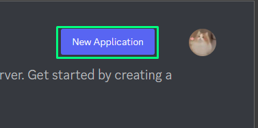
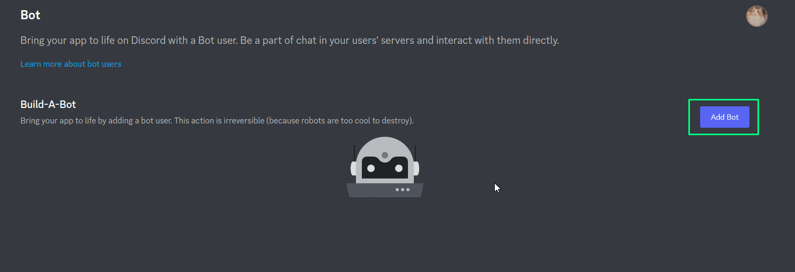

Для использования вам нужно зарегистрировать приложение в Discord Developer Portal [ТЫК](https://discord.com/developers/applications)

После создания приложения переходим ко вкладке "Bot".

Далее создаём бота нажав на кнопку "Add Bot" и подтверждаем создание.

Далее получаем токен бота нажав на "Reset Token". После получения токена сохраните его в надёжном месте (не в чате Discord :D ).

Далее включаем интенты бота (нужно спуститься вниз и включить 3 переключателя).

Всё готово! Теперь мы можем использовать нашего бота!