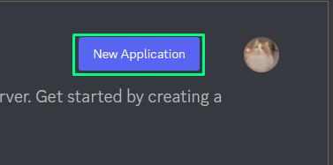
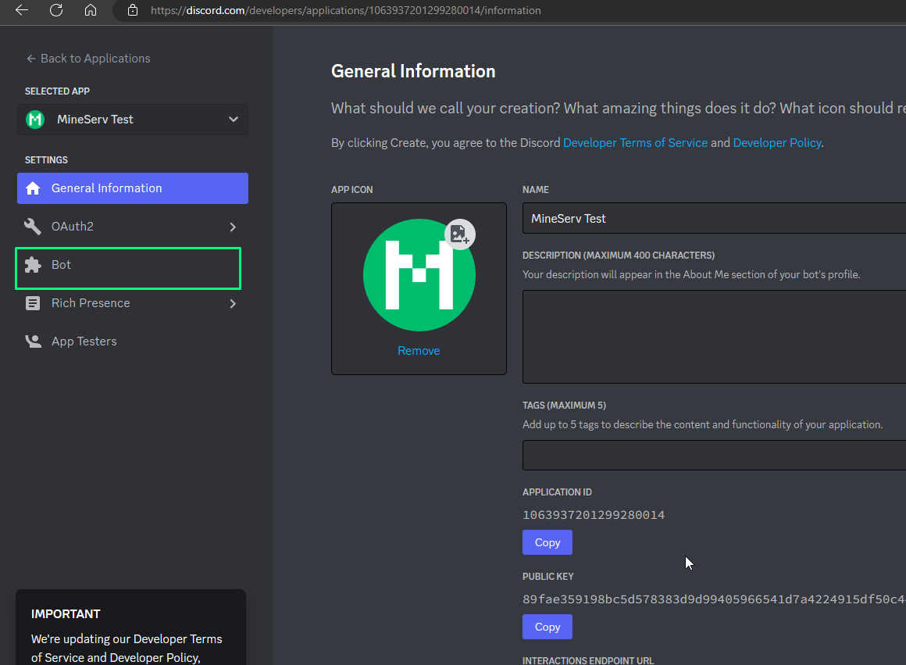
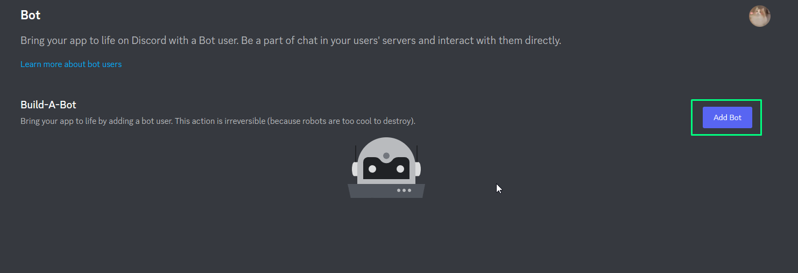
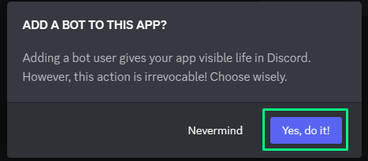
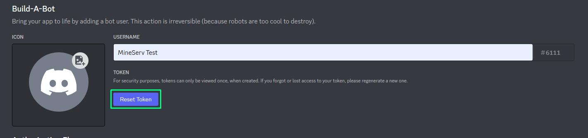

# MineServ Discord Rewards - крутой бот от мониторинга для вашего Discord сервера!

MineServ Discord Rewards - это хороший способ наградить игроков вашего сервера за голосование на мониторинге MineServ.

Данный бот добавит на ваш Discord сервер систему баллов, за которые ваши игроки смогут купить роли на сервере, которые настраиваются в конфиге.

Функционал данного бота со временем будет только расширяться и будут добавляться новые способы наградить игроков внутри вашего Discord сервера.

Для использования вам нужно зарегистрировать приложение в Discord Developer Portal [ТЫК](https://discord.com/developers/applications)

После создания приложения переходим ко вкладке "Bot".

Далее создаём бота нажав на кнопку "Add Bot" и подтверждаем создание.

Далее получаем токен бота нажав на "Reset Token".

